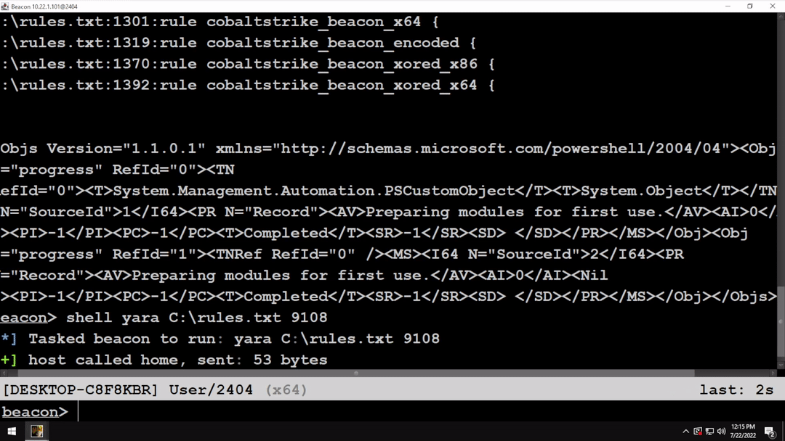

# AceLdr - Avoid Memory Scanners
A position-independent reflective loader for Cobalt Strike. Zero results from [Hunt-Sleeping-Beacons](https://github.com/thefLink/Hunt-Sleeping-Beacons), [BeaconHunter](https://github.com/3lp4tr0n/BeaconHunter), [BeaconEye](https://github.com/CCob/BeaconEye), [Patriot](https://github.com/joe-desimone/patriot), [Moneta](https://github.com/forrest-orr/moneta), [PE-sieve](https://github.com/hasherezade/pe-sieve), or [MalMemDetect](https://github.com/waldo-irc/MalMemDetect).

## Features

#### Easy to Use
Import a single CNA script before generating shellcode.

#### Dynamic Memory Encryption
Creates a new heap for any allocations from Beacon and encrypts entries before sleep.

#### Code Obfuscation and Encryption
Changes the memory containing CS executable code to non-executable and encrypts it (FOLIAGE).

#### Return Address Spoofing at Execution
Certain WinAPI calls are executed with a spoofed return address (InternetConnectA, NtWaitForSingleObject, RtlAllocateHeap).

#### Sleep Without Sleep
Delayed execution using WaitForSingleObjectEx.

#### RC4 Encryption
All encryption performed with SystemFunction032.

## Known Issues
- Not compatible with loaders that rely on the shellcode thread staying alive.

## References
This project would not have been possible without the following:
- [FOLIAGE](https://github.com/secidiot/FOLIAGE)
- [x64 return address spoofing (source + explanation)](https://www.unknowncheats.me/forum/anti-cheat-bypass/268039-x64-return-address-spoofing-source-explanation.html)

## Malleable C2 Profile requirements
    set sleep_mask "false";
    
Other features and inspiration were taken from the following:
- [https://www.arashparsa.com/bypassing-pesieve-and-moneta-the-easiest-way-i-could-find/](https://www.arashparsa.com/bypassing-pesieve-and-moneta-the-easiest-way-i-could-find/)
- [https://github.com/secidiot/TitanLdr](https://github.com/secidiot/TitanLdr)
- [https://github.com/JLospinoso/gargoyle](https://github.com/JLospinoso/gargoyle)
- [https://www.forrest-orr.net/post/masking-malicious-memory-artifacts-part-ii-insights-from-moneta](https://www.forrest-orr.net/post/masking-malicious-memory-artifacts-part-ii-insights-from-moneta)
- [https://www.arashparsa.com/hook-heaps-and-live-free/](https://www.arashparsa.com/hook-heaps-and-live-free/)
- [https://blog.f-secure.com/hunting-for-gargoyle-memory-scanning-evasion/](https://blog.f-secure.com/hunting-for-gargoyle-memory-scanning-evasion/)
- [https://www.elastic.co/blog/detecting-cobalt-strike-with-memory-signatures](https://www.elastic.co/blog/detecting-cobalt-strike-with-memory-signatures)
